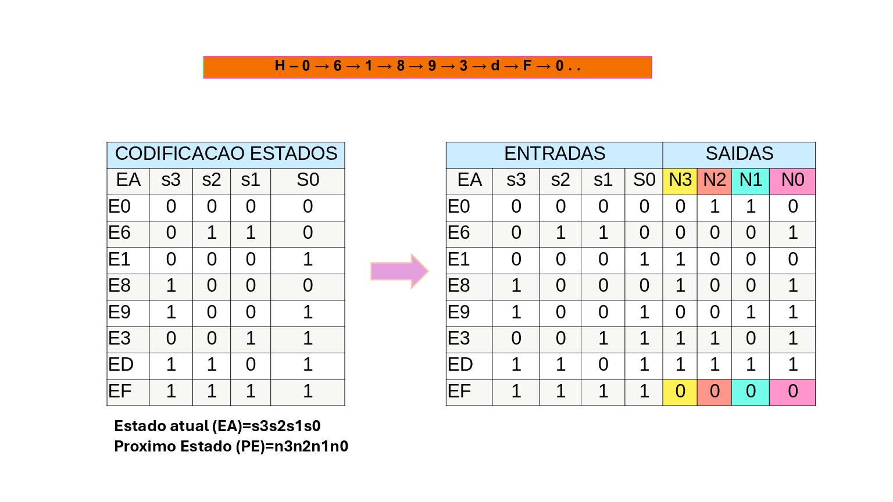

<h1 align="center">
  <strong> EEL51015: Circuitos e Técnicas Digitais
 - UFSC</strong>
</h1>

Semestre: 2023-1 Exercício 3 - Circuitos Sequenciais: Projeto FSM 

#

Tarefa: Implementar um circuito que mostre a sequência cı́clica de 8 estados em hexadecimal. Cada aluno/dupla deve fazer a sequência da lista abaixo que será indicada pelo professor. Para obter dito circuito use a abordagem de resolução de projeto FSM aprendida na teoria. O sistema deve possuir uma entrada de clock e um
reset em KEY (0). A sequência deve ser mostrada numa saı́da S de 4 bits em formato binário nos LEDR(3 . . . 0) e em formato hexadecimal no Display HEX0.

• Entregar os seguintes passos para resolução do projeto FSM:
<b>

(i) Diagrama de estados;

(ii) Codificão de estados; 

(iii) Tabela de transição de estados; 

(iv) Mapas para obter circuito lógico do próximo estado e saı́das;

(v) Desenho do Circuito.
</b>

Tarefa: Implementar um circuito que mostre a sequência cı́clica de 8 estados em hexadecimal. Cada aluno/dupla deve fazer a sequência da lista abaixo que será indicada pelo professor. Para obter dito circuito use a abordagem de resolução de projeto FSM aprendida na teoria. O sistema deve possuir uma entrada de clock e um
reset em KEY (0). A sequência deve ser mostrada numa saı́da S de 4 bits em formato binário nos LEDR(3 . . . 0) e em formato hexadecimal no Display HEX0.

• Entregar os seguintes passos para resolução do projeto FSM:
<b>

(i) Diagrama de estados;

(ii) Codificão de estados; 

(iii) Tabela de transição de estados; 

(iv) Mapas para obter circuito lógico do próximo estado e saı́das;

(v) Desenho do Circuito.
</b>
# 

Sequências:

A – 0 → 9 → 4 → b → C → 6 → 1 → F → 0 . . . 

B – 0 → b → A → 2 → 3 → C → 7 → F → 0 . . .

C – 0 → 1 → b → 3 → 4 → d → 8 → F → 0 . . .

D – 0 → 2 → C → 4 → 5 → E → 9 → F → 0 . . .

E – 0 → 3 → d → 5 → 6 → b → A → F → 0 . . .

F – 0 → 4 → E → 6 → 7 → 1 → b → F → 0 . . .

G – 0 → 5 → 3 → 7 → 8 → 2 → C → F → 0 . . .

H – 0 → 6 → 1 → 8 → 9 → 3 → d → F → 0 . . .

I – 0 → 7 → 2 → 9 → A → 4 → E → F → 0 . . .

J – 0 → 8 → 3 → A → b → 5 → C → F → 0 . . .

link do excel com dados das sequencias acima: 

[EXERCICIO 3 - EEL5105 - CIRCUITOS DIGITAIS](https://docs.google.com/spreadsheets/d/1t67oP3QdkIf7zlZNU1o1ns9iy7dVyALB/edit?gid=1708467906#gid=1708467906)

[LINK para Karnaugh map e o circuitos](http://www.32x8.com/var4kmapx.html)

# 

### Minha avaliação foi com a sequência H.

 

 
<b> Codificão de estados e Tabela de transição de Estados </b>

  

 
<b> Mapas para obter circuito lógico do próximo estado e saı́das</b>

Os proximos estados N3, N2, N1 e N0 e o Mapa de karnaugh de cada  (PE) com seus expectivos Circuitos.

