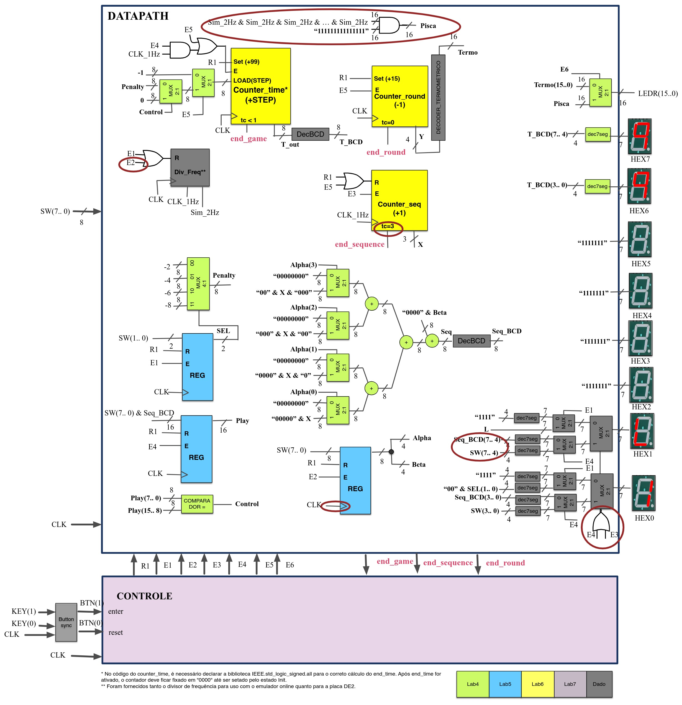

### PROJETO FINAL DE CIRCUITOS DIGITAIS - JOGO DAS SEQUENCIAS 

| Código  | Disciplina                | Nota | Funciona|
| ------  | :-----------------------: | ---- | ------- |
| Projeto final    | [Projeto Final ](https://github.com/pamelamontteiro/UFSC/tree/main/EEL5105/Jogo%20das%20sequencias/ARQUIVOS%20VHDL) | Nota: 10 | Sim |
#
Durante a disciplina de Circuitos e Técnicas Digitais, foi elaborado um <b> trabalho final</b> consiste na implementação de um circuito na placa de desenvolvimento DE2 fazendo uso das estruturas
e conhecimentos obtidos durante o curso. O circuito vai implementar a um jogo interativo de dois jogadores, um jogador que introduz as sequencias (J1) e o jogador que deve adivinhar a continuação das sequencias em BCD mostradas no displays
(J2).


<BR>


<br>
<b>  Estados do Jogo </b> 
O jogo segue uma sequência de estados bem definida, e cada estado é responsável por uma tarefa específica:

<b> 1 .Estado Init </b>
*   Função: Reseta o jogo e prepara o sistema para  o próximo ciclo de jogo.
*   Transição: Após a inicialização, vai para o estado Setup.


<b> 2. Estado Setup </b>
*   Função: Escolha do nível de dificuldade (0 a 3).
*   Entrada: O jogador escolhe o nível com os switches SW(1..0). O nível é mostrado em HEX0 e o tipo de nível (0, 1, 2 ou 3) é exibido em HEX1.
*   Saída: O número de rodadas (16) é mostrado nos LEDRs em formato termométrico.
*   Transição: Após a seleção, o jogo vai para o estado Select após pressionar o botão KEY1.

<b> 3. Estado Select </b>

<b> Função </b>: Seleção dos parâmetros α (alpha) e β (beta) da equação <b> F=α×X+β.</b>

<b> Entrada </b>:
*   O jogador escolhe α (1 a 15) e β (1 a 15) usando os switches <b> SW(7..4) </b> para α e <b> SW(3..0) </b> para β.

*   A seleção é feita secretamente para o jogador J2.

*   Transição: Após a escolha, o jogador pressiona KEY1 e zera os switches. A partir daí, o jogo vai para o estado Sequence.


<b> 4. Estado Sequence </b>
*   Função: Exibição da sequência de 4 valores em BCD para o jogador J2.

    Entrada:
    * Exibição da contagem regressiva em <b> HEX7 e HEX6 (99 segundos)</b> .
    * A sequência de 4 números é exibida em <b> HEX1 e HEX0</b> com frequência de 1Hz.

* Transição: Após exibir a sequência, o sistema ativa o sinal end_sequence e transita para o estado Play.

<b>5. Estado Play </b>
*   Função: O jogador J2 tenta adivinhar o próximo valor da sequência.

Entrada: O valor correto é calculado como <b> α×4+β </b>, e J2 deve inseri-lo via switches <b> SW(7..0) </b>.


*   Transição: O jogador pressiona KEY1 após inserir o valor, e a contagem regressiva é interrompida. O jogo transita para o estado Check.

<b>6. Estado Check </b>
*   Função: Verificação da resposta do jogador (J2) para a sequência.

*   Entrada: Se J2 acertou ou errou a sequência, o sistema ajusta o <b> tempo (subtrai 2, 4, 6 ou 8 segundos </b> dependendo do nível de dificuldade).

*   Transição: Após a verificação, o sistema decrementa o contador de rodadas e retorna ao estado Select para a próxima rodada.

<b>7. Estado Result </b>
*   Função: Exibição do tempo restante e indicação do fim do jogo.

*   Saída: Mostra o tempo restante em HEX7 e HEX6, e os LEDRs piscam a 2Hz.

*  Transição: O jogador pressiona KEY1 para voltar ao estado Init e reiniciar o jogo.

<b> Reset (Init)</b>
*   Função: <b> Reset </b> total do sistema para <b> reiniciar o jogo </b>.

*   Entrada: O botão KEY0 é pressionado a qualquer momento para <b> resetar o sistema </b>.
#

### diagrama de estados e Tabela de estados (controle)


<br>


#
<br> 
2. <b> Comandos Importantes </b>

Switches (SW): São usados para selecionar os níveis de dificuldade e para definir os parâmetros da equação <b> F=α×X+β </b>.

<b> SW(7..4)</b>: α (1 a 15).
<b> SW(3..0)</b>: β (1 a 15).
<b> SW(1..0)</b>: Nível de dificuldade (0 a 3).

<b> Botão KEY1 </b>: Usado para:

*   Avançar para o próximo estado.
*   Confirmar escolhas do jogador (como a escolha de α e β ou a entrada da resposta).

<b> Botão KEY0</b>: Reset total do sistema.
<br><br>
3. <b>  Entradas e Saídas </b>

Entradas:

<b>  SW(7..0)</b>: Valores de α, β, e as escolhas de dificuldade.
<b> KEY1</b>: Botão de confirmação de cada estado.
<b>  KEY0</b>: Botão de reset do sistema.

Saídas:
*  <b> Displays HEX7 a HEX0</b>: Exibição do tempo restante, sequência de números e o nível de dificuldade.
*  <b>  LEDRs</b>: Exibição do número de rodadas e piscamento no estado Result.

<br> <br>
4. <b> Tempos e Temporização </b>

Contagem Regressiva:
*   A contagem regressiva de 99 segundos é exibida nos HEX7 e HEX6 no estado Sequence.

*   No estado Check, o tempo é subtraído em função do nível de dificuldade se o jogador errar a sequência.

<b> Ajuste de Tempo</b>: 
A penalização por erro depende do nível de dificuldade:
-   Nível 0: Subtrai 2 segundos.
-   Nível 1: Subtrai 4 segundos.
-   Nível 2: Subtrai 6 segundos.
-   Nível 3: Subtrai 8 segundos.
#

<b> O codigo foi desenvolvido em VHDL</b>: 

 ```vhdl

-- lógica da soma da sequência

muxsomaX0<= "00000" & X;
muxsomaX1<= "0000" & X & "0";
muxsomaX2<= "000" & X & "00";
muxsomaX3<= "00" & X & "000";
muxsomaBeta <= "0000" & Beta;

muxsoma1: Mux2_1x8 port map( Alpha(3), "00000000", muxsomaX3, mux_soma1);
muxsoma2: Mux2_1x8 port map( Alpha(2), "00000000",muxsomaX2,mux_soma2);
muxsoma3: Mux2_1x8 port map( Alpha(1), "00000000",muxsomaX1,mux_soma3);
muxsoma4: Mux2_1x8 port map( Alpha(0), "00000000",muxsomaX0,mux_soma4);


somador1: somador port map(mux_soma1, mux_soma2, soma1);
somador2: somador port map(mux_soma3, mux_soma4, soma2);
somador3: somador port map(soma1, soma2, soma3);
somadorSeq: somador port map(soma3, muxsomaBeta, Seq);

decBCDsoma: decBCD port map(Seq, Seq_BCD);

 '''
