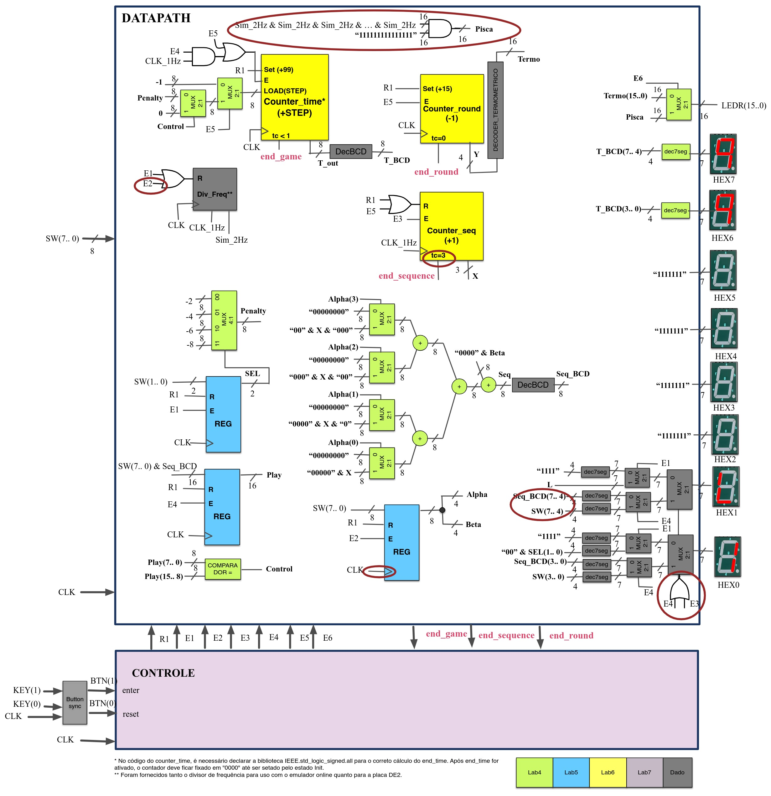

# UFSC EEL5105 – Circuitos e Técnicas Digitais

Esta disciplina abrange aulas teóricas e práticas, ministradas nos laboratórios. Durante as práticas, aprendemos a programar em VHDL utilizando o dispositivo FPGA na placa DE1-SOC. A parte prática da disciplina consiste em tarefas realizadas em aula, 4 exercícios avaliativos ao longo do semestre e um trabalho final.

## Exercicios

| Código  | Disciplina                | Nota | Funciona|
| ------  | :-----------------------: | ---- | ------- |
| Ex 1    | [Exercicio 1 ](https://github.com/pamelamontteiro/UFSC/tree/main/EEL5105/Ex%201) | Nota: 10 | Sim |
| Ex 2    | [Exercicio 2 ](https://github.com/pamelamontteiro/UFSC/tree/main/EEL5105/Ex%202) | Nota: 10 | Sim |
| Ex 3    | [Exercicio 3 ](https://github.com/pamelamontteiro/UFSC/tree/main/EEL5105/Ex%203) | Nota: 10 | Sim |
| Ex 4    | [Exercicio 4 ](https://github.com/pamelamontteiro/UFSC/tree/main/EEL5105/Ex%204) | Nota: 10 | Sim |

<b>Exercicio 2 </b>

Tarefa: Implemente um circuito aritmético que contenha um operando A (4bits em complemento de 2) cuja operação seja escolhida pelo controle C (2 bits). O circuito deve realizar as 4 operações mostradas na tabela da Figura abaixo. A saı́da deve ser mostrada nos displays HEX6, HEX5, HEX4, HEX3, HEX2, HEX1, HEX0,
conforme segue:

• <b>HEX6</b> e <b>HEX5</b> indicam o sinal e o valor da entrada A, respectivamente;

• <b>HEX4</b> indica a operação selecionada: soma ou subtração (sı́mbolo + ou −);

• <b> HEX3</b> o mostra o valor a ser somado ou subtraı́do atendendo a seleção de C (conforme tabela de operações da Figura);

• <b> HEX2</b> indica um sı́mbolo de igualdade (=);

• <b> HEX1</b> e <b> HEX0</b> indicam o sinal e o valor do resultado (dado pelo vetor F ), respectivamente.


<br><br>
<b>
[Parte 2] </b> Obter uma solução otimizada sem o uso de multiplexadores. Para evitar o
uso do multiplexador 4 : 1, tente fazer as quatro operações redistribuindo os bits de C
em uma única operação de soma (Dica: ver exemplo similar na Figura seguinte). Para a
redistribuição dos bits podem ser usados operadores & (encadeamento) e portas NOT.
Para evitar o uso dos multiplexadores 2 : 1 use a mesma abordagem, redistribuindo
os bits de seleção em um único vetor de entrada.

<br>

 
 <br>
 <b>
 -> Logica da Otimização da parte 2 - VHDl
 </b>
 
 ```vhdl

A <= SW(3 downto 0);
C <= SW(9 downto 8);

V <= C(1) & '1' & C(1) & C(0);

HEX2 <= "0110111";
HEX6 <= not A(3) & "111111";
HEX1 <= not F(3) & "111111" ;
HEX4 <= "0" & C(1) & C(1) & "1111";
F <= A + V;

 ```

#
<b>Exercicio 3 </b>

Tarefa: Implementar um circuito que mostre a sequência cı́clica de 8 estados em hexadecimal. Cada aluno/dupla deve fazer a sequência da lista abaixo que será indicada pelo professor. Para obter dito circuito use a abordagem de resolução de projeto FSM aprendida na teoria. O sistema deve possuir uma entrada de clock e um
reset em KEY (0). A sequência deve ser mostrada numa saı́da S de 4 bits em formato binário nos LEDR(3 . . . 0) e em formato hexadecimal no Display HEX0.

• Entregar os seguintes passos para resolução do projeto FSM:
<b>

(i) Diagrama de estados;

(ii) Codificão de estados; 

(iii) Tabela de transição de estados; 

(iv) Mapas para obter circuito lógico do próximo estado e saı́das;

(v) Desenho do Circuito.
</b>

#
Minha sequências foi o H : 


<br>
<p align="center"> 
<b> Codificão de estados e Tabela de transição de Estados </b>
</p>


<br> 
<p align="center"> 
<b> Mapas para obter circuito lógico do próximo estado e saı́das</b>
</p>


Os proximos estados N3, N2, N1 e N0 e o Mapa de karnaugh de cada  (PE) com seus expectivos Circuitos.


## Projeto final
O trabalho final consiste na implementação de um circuito na placa de desenvolvimento DE2 fazendo uso das estruturas
e conhecimentos obtidos durante o curso. O circuito vai implementar a um jogo interativo de dois jogadores, um jogador que introduz as sequencias (J1) e o jogador que deve adivinhar a continuação das sequencias em BCD mostradas no displays
(J2).


| Código  | Disciplina                | Nota | Funciona|
| ------  | :-----------------------: | ---- | ------- |
| Projeto final    | [Projeto Final ](https://github.com/pamelamontteiro/UFSC/tree/main/EEL5105/Projeto%20Final) | Nota: 10 | Sim |

#
