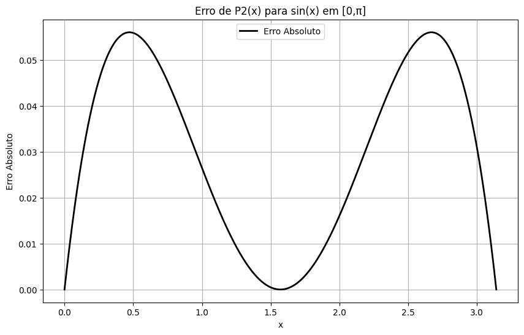
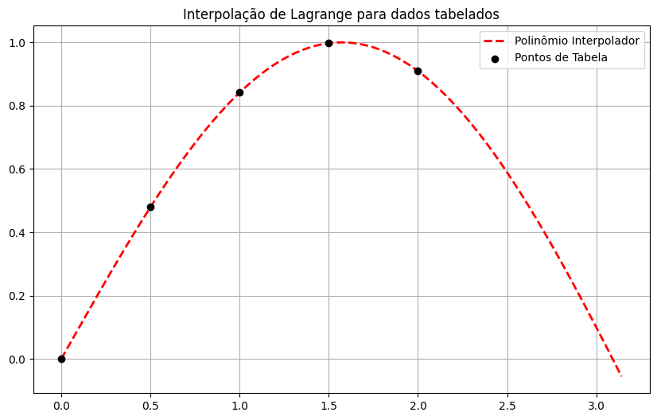

### Exercicio 5 


<b> EXERCÍCIO 1</b>

Implementar um algoritmo em Octave ( deve enviar o Algoritmo implemntado em Octave( ou em Outra linguagem)) que determine os coeficientes de polinômio interpolação de qualquer grau para uma função qualquer, podendo ser dada na forma analitica ou tabelada e plote os gáficos da função original e do polinômio obtido. Note que, para a plotagem da função, a forma de Honer, disponivel na função fPnH. m deverá ser utilizada.


```matlab

function [Pn,dataX,dataY] = exercicio01(n, limites, modoEntrada, varargin)
    
if strcmp(modoEntrada,'fun_anl') % A entrada é uma função
    f = varargin{1};
    x = limites(1):(limites(2)-limites(1))/n:limites(2);
    y = f(x);
else if strcmp(modoEntrada, 'table') % A entrada é uma tabela de dados
    x = varargin{1};
    y = varargin{2};
    end
end
% Matrizes do sistema
dataX = zeros(n+1);
dataY = zeros(1,n+1);
for i = 1:n+1
    for j = 1:n+1
        dataX(i,j) = x(i)^(j-1);
    end
    dataY(1,i) = y(i);
end 
% Resolução do Sistema
Pn = fGauss(dataX,dataY',n+1);
% Gráficos
figure(), plot(x, y, '*r', 'Linewidth', 1.4, 'MarkerSize', 8), hold on, grid on
plot(limites(1):1e-2:limites(2), fPnH(n, Pn, limites(1):1e-2:limites(2)), ':k', 'Linewidth', 1.4)
legend('Pontos tabelados', 'Polinômio Interpolador','Location','south')
title(['P',num2str(n),'(x) X dados tabelados'])

end

```

<b> EXERCÍCIO 2</b>

Utilizando o algoritmo implentado, aproxime as seguintes funções, nos intervalos mostrados através de um polin^mino de 2°, 4° e 6° graus. <b> Plote em um mesmo gráfico a função e o polinômio interpolador ( utilize o código fornecido no Mooodle). Plote em outro gráfico o erro de interpolação, como função de x.</b>

A)
$$
 f(x) = sin(x) x ∈ [0,\pi ]
$$

B)
$$
 f(x) = ln(x) x ∈ [1,3 ]
$$

C)
$$
 f(x) = ln(x) x ∈ [0.1,2.1]
$$


```matlab

%% Tarefa 5 -- Exercício 2
% Aproximação das funções (a), (b) e (c) através do algoritmo implementado

% Limpa a tela e variáveis
clear, clc, close all

% Funções e limites
funcA = @(x) sin(x); % Função (a)
limitesA = [0, pi]; domA = linspace(limitesA(1), limitesA(2), 100);
funcB = @(x) log(x); % Função (b)
limitesB = [1, 3]; domB = linspace(limitesB(1), limitesB(2), 100);
funcC = @(x) log(x); % Função (c)
limitesC = [0.1, 2.1]; domC = linspace(limitesC(1), limitesC(2), 100);

% Definição de legendas
string_legend = {' sin(x) em [0, \pi]', ' ln(x) em [1, 3]', ' ln(x) em [0.1, 2.1]'};

% Limites e funções para cada caso
limites = {limitesA, limitesB, limitesC};
func = {funcA, funcB, funcC};
dominios_func = {domA, domB, domC};

% Número de polinômios
num_P = 1;
P = cell(1, 6); % 6 Polinômios salvos em P

% Loop para as 3 funções
for funcao = 1:3
    for grau = 2:2:6
        % Interpolação de polinômio
        P{num_P} = interpola_fn('fn', grau, func{funcao}, limites{funcao});
        
        % Plotando a função original e o polinômio interpolador
        figure;
        plot(dominios_func{funcao}, func{funcao}(dominios_func{funcao}), 'b', 'LineWidth', 1.6);
        hold on;
        plot(dominios_func{funcao}, fPnH(grau, P{num_P}, dominios_func{funcao}), 'r', 'LineWidth', 1.6);
        legend('Função Original', 'Polinômio Interpolador', 'Location', 'Best');
        title(strcat('P', num2str(grau), '(x) Interpolador de', string_legend{funcao}));
        grid on;
        
        % Calculando o erro absoluto
        erro = abs(fPnH(grau, P{num_P}, dominios_func{funcao}) - func{funcao}(dominios_func{funcao}));
        
        % Plotando o erro
        figure;
        plot(dominios_func{funcao}, erro, 'k', 'LineWidth', 1.5);
        title(strcat('Erro de P', num2str(grau), '(x) para', string_legend{funcao}));
        grid on;
        ylabel('Erro Absoluto');
        
        % Incrementando o número do polinômio
        num_P = num_P + 1;
    end
end

% Função de interpolação (assumindo uma implementação já existente)
function P = interpola_fn(tipo, grau, f, limites)
    % Cria os pontos de interpolação no intervalo [a, b]
    x = linspace(limites(1), limites(2), grau+1);
    y = f(x);
    
    % Matriz de Vandermonde
    X = zeros(grau+1, grau+1);
    for i = 1:grau+1
        for j = 1:grau+1
            X(i,j) = x(i)^(j-1);
        end
    end
    
    % Vetor de valores de f(x)
    Y = y(:);
    
    % Resolvendo o sistema linear X * P = Y
    P = X \ Y;
end

% Função de avaliação do polinômio (assumindo uma implementação já existente)
function y = fPnH(grau, P, x)
    % Avalia o polinômio na forma de Horner
    n = length(x);
    y = P(end) * ones(size(x));  % Começa com o termo de maior grau
    for i = grau:-1:1
        y = P(i) + x .* y;  % Aplica Horner para cada termo
    end
end


```
# Gráficos funções e polinômios interpoladores:

Questão A

* Polinômio 2º grau:




<br> <br> 
* Polinômio 4º grau:


<br> 


* Polinômio 6º grau:


<br> 


#
Questão B

* Polinômio 2º grau:


Erro 


* Polinômio 4º grau:


Erro 


* Polinômio 6º grau:


Erro 


#
Questão C

* Polinômio 2º grau:


Erro


* Polinômio 4º grau:


Erro


* Polinômio 6º grau:


Erro


<br> <br>


<b> EXERCÍCIO 3</b><br> 

Implementação um algoritmo em Octave ( deve estar o algoritmo implemnatado em Octave (ou outra linguagem)) que avalie uma função qualquer, podendo ser dada na forma analitica ou tabelada, através de interpolação a partir de bases de polinômios de Lagrange.

```matlab

function [Pn, PLagrange] = exercicio03(n, dominio, modoEntrada, varargin)

    
    if strcmp(modoEntrada, 'fun_anl')  % Caso em que a entrada é uma função analítica
        f = varargin{1};               % Função fornecida pelo usuário
        limites = varargin{2};         % Limites do intervalo
        % Gerar os pontos de interpolação igualmente espaçados
        x = linspace(limites(1), limites(2), n+1); 
        y = f(x);                      % Valores da função nos pontos x
    elseif strcmp(modoEntrada, 'table')  % Caso em que a entrada é uma tabela de pontos
        x = varargin{1};               % Valores de X fornecidos
        y = varargin{2};               % Valores de Y fornecidos
    else
        error('Modo de entrada inválido. Escolha "fun_anl" ou "table".');
    end
    
    % Inicialização do polinômio interpolador Pn(x) como zero
    Pn = 0;
    % Armazenamento das bases de Lagrange individuais
    PLagrange = cell(1, n+1);
    
    % Loop para calcular os polinômios de Lagrange Lk(x) e o polinômio interpolador Pn(x)
    for k = 1:n+1
        L = 1;
        for j = 1:n+1
            if j ~= k
                L = L .* (dominio - x(j)) / (x(k) - x(j));  % Fórmula do polinômio de Lagrange Lk(x)
            end
        end
        PLagrange{k} = L;                 % Armazenar a base de Lagrange
        Pn = Pn + y(k) .* L;              % Somar o termo correspondente para o polinômio Pn(x)
    end
end


```
# Resposta Questao 3


<br>



<b> EXERCÍCIO 4</b>

1)    Utilizando o algoritmo implementado na questão anterior, escreva em uma tabela, os valores dos 5 polinômios de grau 4, para valores de  x ∈ [-1,1], em intervalos de 0,25, considerando como "nós" os valores x<sub>i</sub> = -1.0, -0.5, 0.0, 0.5, 1.0

2) Calcule, com base no valores da tabela acima, os valores se sen(x) para cada x, intermediario, completando a última coluna da tabela.


| i  | x<sub>i</sub> | L<sub>1</sub>(x<sub>i</sub>)| L<sub>2</sub>(x<sub>i</sub>)| L<sub>3</sub>(x<sub>i</sub>)| L<sub>4</sub>(x<sub>i</sub>)|L<sub>5</sub>(x<sub>i</sub>)|f<sub>aprox</sub>(x<sub>i</sub>)|
| ------ | :-----------------------: |---- |---- |---- |---- |---- |---- |
|1 | -1.0 | 1.000 | 0.000 | 0.000 | 0.000 | 0.000|
|2 | - 0.75 |  | |  |  |  |
|3 | -0 .5 | 0.000 | 1.000 | 0.000 | 0.000 | 0.000|
|4 | - 0.25 |  | |  |  |  |
|5 | 0.0 | 0.000 | 0.000 | 1.000 | 0.000 | 0.000 |
|6 |  0.25 |  | |  |  |  |
|7 | 0.5 | 0.000 | 0.000 | 0.000 | 1.000 | 0.000 |
|8 |  0.75 |  | |  |  |  |
|9 | 1.0 | 0.000 | 0.000 | 0.000 | 0.000 | 1.000 |

# resposta da questao 4 


```matlab

% Define os nós (valores de x) e os valores da função (f(x) = sin(x))
xi = [-1.0, -0.5, 0.0, 0.5, 1.0];    % Nós de interpolação
yi = sin(xi);                        % f(x) nos nós xi (f(x) = sin(x))

% Define o domínio para o qual vamos avaliar a interpolação
dominio = -1:0.25:1;  % Valores de x para avaliação (em intervalos de 0.25)

% Função para calcular os polinômios de Lagrange L_k(x) para um dado x
function Lk = lagrange_polynomial(x, k, xi)
  n = length(xi);
  Lk = 1;
  for i = 1:n
    if i != k
      Lk = Lk * (x - xi(i)) / (xi(k) - xi(i));
    end
  end
end

% Inicializa a tabela de resultados
tabela = zeros(length(dominio), 7);  % 7 colunas: x, L1, L2, L3, L4, L5, f_aprox(x)

% Preenche a tabela
for i = 1:length(dominio)
  x = dominio(i);
  tabela(i, 1) = x;  % Coloca o valor de x na primeira coluna
  
  % Calcula os polinômios de Lagrange L1, L2, L3, L4, L5 para o valor de x
  for k = 1:5
    tabela(i, k+1) = lagrange_polynomial(x, k, xi);  % Lk(x)
  end
  
  % Calcula a aproximação f_aprox(x) com a soma dos termos Lk(x) * f(xk)
  f_aprox = 0;
  for k = 1:5
    f_aprox = f_aprox + tabela(i, k+1) * yi(k);  % Lk(x) * f(xk)
  end
  tabela(i, 7) = f_aprox;  % Coloca o valor de f_aprox(x) na última coluna
end

% Exibe a tabela de resultados
disp('Tabela de Interpolação de Lagrange:')
disp('  i   |    x    | L1(x) | L2(x) | L3(x) | L4(x) | L5(x) | f_aprox(x)')
disp('-------------------------------------------------------------')
disp(tabela)


```

#
<br>

<b> EXERCÍCIO 5</b>

Aproxime Função, 

$$
\frac{1}{1 + 25x_2} 
$$

<br> 
No intervalo x ∈ [-1,1], através de um polinômio de Lagrange de 4 e 8 graus, considerando pontos igualmente espaçados. Plote em um mesmo gráfico a função e o polinômio interpolador. Plote em outro gráfico o erro de interpolação, com a função x. Avalie o valor da função, utilizando ambas aproximações em x = 0.0 e em x = 0. 75. Aproxime agora a mesma função através de um polinônimo de 8° grau , considerando os valores de x  na mesma quandidade ( 9 pontos), porém distribuidos de acordo com.

$$
x_i = \frac{2_i - 1}{2n} ; i = 1 ... n
$$

|  x<sub>1</sub>  | x<sub>2</sub> |  x<sub>3</sub>|  x<sub>4</sub>|  x<sub>5</sub>|  x<sub>6</sub>| x<sub>7</sub>| x<sub>8</sub>|x<sub>9</sub>|
| ------ | :-----------------------: |---- |---- |---- |---- |---- |---- |---- |
| -0.984808 | -0.866025 | -0.642788 |-0.34202 |0.0 | 0.34202 | 0.642788 |0.866025| 0.984808 |

# Resposta da questao 5

```matlab
% Limpa a tela e as variáveis
clear; clc; close all;

% Definição da função, domínio e graus dos polinômios
fx = @(x) 1 ./ (1 + 25 .* x .^ 2);  % Função f(x)
dom = -1:1e-2:1;  % Domínio para plotagem (intervalo [-1,1])

% Função para interpolação de Lagrange (exercício 3)
function [P, PLagrange] = exercicio03(grau, dominio, tipo, xi, yi)
  if strcmp(tipo, 'fun_anl')
    % Se for função analítica, calculamos os valores da função
    yi = fx(xi);
  elseif strcmp(tipo, 'table')
    % Se for tabela, usamos os valores dados em xi, yi
    % Já temos yi calculado fora
  end
  
  % Calcula os polinômios de Lagrange (uma estrutura para armazenar os termos)
  n = length(xi);  % Número de pontos de interpolação
  PLagrange = cell(1, n);
  
  % Para cada k de 1 a n, calcular L_k(x) (polinômios de Lagrange)
  for k = 1:n
    Lk = ones(1, length(dominio));  % Inicializa L_k(x) como 1
    for j = 1:n
      if j != k
        Lk = Lk .* (dominio - xi(j)) / (xi(k) - xi(j));
      end
    end
    PLagrange{k} = Lk;  % Armazena o polinômio L_k(x)
  end
  
  % Agora, calculamos o polinômio Pn(x) usando os polinômios de Lagrange
  P = zeros(size(dominio));  % Inicializa o polinômio
  for k = 1:n
    P = P + PLagrange{k} * yi(k);  % Soma os termos L_k(x) * f(x_k)
  end
end

% Aproximação de grau 4
xi_4 = linspace(-1, 1, 5);  % 5 pontos igualmente espaçados (grau 4)
[Pol_g4, PLagrange_g4] = exercicio03(4, dom, 'table', xi_4, fx(xi_4));

% Plota o polinômio de grau 4 e a função original
figure();
plot(dom, Pol_g4, '--k', 'Linewidth', 1.5); hold on;
plot(dom, fx(dom), 'r', 'Linewidth', 1.5);
grid on;
title('P4(x) X Função Exata');
legend('P4(x)', 'f(x)');

% Erro absoluto de P4(x)
erro_g4 = abs(Pol_g4 - fx(dom));
figure();
plot(dom, erro_g4, 'k', 'Linewidth', 1.5);
grid on;
title('Erro Absoluto de P4(x)');

% Aproximação de grau 8
xi_8 = linspace(-1, 1, 9);  % 9 pontos igualmente espaçados (grau 8)
[Pol_g8, PLagrange_g8] = exercicio03(8, dom, 'table', xi_8, fx(xi_8));

% Plota o polinômio de grau 8 e a função original
figure();
plot(dom, Pol_g8, '--k', 'Linewidth', 1.6); hold on;
plot(dom, fx(dom), 'r', 'Linewidth', 1.6);
grid on;
title('P8(x) X Função Exata');
legend('P8(x)', 'f(x)');

% Erro absoluto de P8(x)
erro_g8 = abs(Pol_g8 - fx(dom));
figure();
plot(dom, erro_g8, 'k', 'Linewidth', 1.6);
grid on;
title('Erro Absoluto de P8(x)');

% Avaliação dos polinômios em x = 0.0 e x = 0.75
fprintf('P4(0) = %.5f\n', Pol_g4(find(dom == 0)));
fprintf('P8(0) = %.5f\n', Pol_g8(find(dom == 0)));
fprintf('P4(0.75) = %.5f\n', Pol_g4(find(dom == 0.75)));
fprintf('P8(0.75) = %.5f\n', Pol_g8(find(dom == 0.75)));

% Aproximação de grau 8 usando nós de Chebyshev
n = 9;  % Número de pontos (grau 8)
xChebyshev = cos((2 * (1:n) - 1) * pi / (2 * n));  % Nós de Chebyshev
yChebyshev = fx(xChebyshev);  % Calcula f(xi) nos nós de Chebyshev

% Calcula o polinômio de grau 8 usando nós de Chebyshev
[PolCh, PLagrange_Ch] = exercicio03(8, dom, 'table', xChebyshev, yChebyshev);

% Plota o polinômio de grau 8 com Chebyshev e a função original
figure();
plot(dom, PolCh, '--k', 'Linewidth', 1.6); hold on;
plot(dom, fx(dom), 'r', 'Linewidth', 1.6);
grid on;
title('P8(x) com Nós de Chebyshev X Função Exata');
legend('P8(x) Chebyshev', 'f(x)');

% Erro absoluto de P8(x) com Chebyshev
erroCh = abs(PolCh - fx(dom));
figure();
plot(dom, erroCh, 'k', 'Linewidth', 1.6);
grid on;
title('Erro Absoluto de P8(x) com Nós de Chebyshev');


```
<b>1. Gráfico 1: Polinômio de Grau 4 e Função Original</b> <br>


<br><br> 
<b>2. Gráfico 2: Erro Absoluto do Polinômio de Grau 4</b>
 <br> <br> 

<br><br>
<b>3. Gráfico 3: Polinômio de Grau 8 e Função Original</b>  

<br><br> 
<b>4. Gráfico 4: Erro Absoluto do Polinômio de Grau 8</b> <br> <br> 

#

<br>
<b> EXERCÍCIO 6</b>

Implemente um algoritmo em Octave ( deve enviar o Algoritmo implemntado em Octave), dado um conjunto de  valores tabelados, faça um ajuste polinomial pelo método dos minimos quadrados, para um valor qualquer de pontos e polinômio de qualquer grau n.

Comandos para fazer a leitura direta dos valores através da função csvread do Octave:

data = csread( 'Dataset.csv');
x = data(: ,1);
y = data(: ,2);

Neste caso se atribui a um vetor com nome " x " os valores da primeira coluna do arquivo e a um vetor " y " os valores da segunda coluna.

#
<b> Resposta da Questão 6</b>

```matlab 
%% Tarefa 5 -- Exercício 6 - Ajuste Polinomial por Mínimos Quadrados

% Interpolação pelo método dos mínimos quadrados com os dados vindos de um arquivo .csv

% Argumentos:
% n - Grau do polinômio interpolador
% datapath - Caminho do arquivo .csv
% semplot - Seleciona se o gráfico de Pn(x) é plotado (0 para plotar, 1 para não plotar)

function Pn = exercicio06(n, datapath, semplot)
    
    % Lê os dados do arquivo .csv (considerando que não há cabeçalho)
    data = csvread(datapath);  % Pode ser necessário usar 'dlmread' se houver problemas com 'csvread'
    dadosX = data(:,1);        % Primeira coluna - X
    dadosY = data(:,2);        % Segunda coluna - Y
    
    % Criação da matriz de design X para o sistema linear
    X = zeros(length(dadosX), n+1);
    y = dadosY;  % o vetor y é simplesmente a segunda coluna dos dados
    
    % Preenche a matriz X com potências de X
    for i = 1:length(dadosX)
        for j = 1:n+1
            X(i,j) = dadosX(i)^(j-1);  % Preenche com X^(j-1)
        end
    end
    
    % Resolve o sistema linear para encontrar os coeficientes do polinômio
    % Pn = (X' * X)^(-1) * (X' * y) --> Resolução do sistema normal dos mínimos quadrados
    Pn = inv(X' * X) * (X' * y);  % Coeficientes do polinômio
    
    % Se semplot == 0, plota os gráficos
    if semplot == 0
        % Domínio para o gráfico do polinômio ajustado (gera valores de X no intervalo dos dados)
        dom = linspace(min(dadosX), max(dadosX), 100);
        
        % Calcula os valores do polinômio ajustado Pn nos pontos dom
        Pn_vals = fPnH(n, Pn, dom);
        
        % Plota os dados originais (pontos) e o polinômio ajustado
        figure();
        plot(dadosX, dadosY, 'or', 'MarkerFaceColor', 'r', 'MarkerSize', 6); hold on;
        plot(dom, Pn_vals, '--k', 'LineWidth', 2);
        grid on;
        title(['Ajuste Polinomial de grau ', num2str(n), ' por Mínimos Quadrados']);
        xlabel('x');
        ylabel('y');
        legend('Dados Originais', 'Polinômio Ajustado', 'Location', 'Best');
    end
end

%% Função auxiliar fPnH para calcular o valor do polinômio ajustado
function Pn_vals = fPnH(n, Pn, dom)
    % Calcula os valores do polinômio Pn para um conjunto de pontos dom
    Pn_vals = zeros(size(dom));
    for i = 1:length(dom)
        % Calcula o valor do polinômio para cada ponto dom(i)
        Pn_vals(i) = 0;
        for j = 1:n+1
            Pn_vals(i) = Pn_vals(i) + Pn(j) * dom(i)^(j-1);
        end
    end
end

```

<b>1. Gráfico 1: Polinômio de Grau 3 e Função </b><br><br>


<b>2. Gráfico 2: Polinômio de Grau 5 e Função </b><br><br>


<br><br>
<b> EXERCÍCIO 7</b>

Dado o conjunto de pontos mostrados na tabela, determine os polinômios de ajuste de 3° e 5 ° graus, por minimos quadrados. 

A) Avalie o ajuste em x = 1.210 e x = 2.144, determine o valor desvio nestes pontos, para cada valor de n.
```matlab

% Função para ajuste polinomial pelo método dos mínimos quadrados
function coef = ajuste_polinomial(x, y, grau)
  % Criar a matriz de Vandermonde para o grau especificado
  X = zeros(length(x), grau + 1);
  for i = 1:length(x)
    for j = 1:(grau + 1)
      X(i, j) = x(i)^(j-1);  % Preenche a matriz X com as potências de x
    end
  end
  
  % Resolver o sistema para encontrar os coeficientes (mínimos quadrados)
  coef = (X' * X) \ (X' * y);
end

% Função para avaliar o polinômio nos pontos x
function y = avaliar_polinomio(coef, x)
  y = zeros(size(x));
  grau = length(coef) - 1;
  for i = 1:length(x)
    % Avalia o polinômio em x usando os coeficientes
    y(i) = sum(coef' .* (x(i).^(0:grau)));
  end
end

% Carregar os dados do arquivo CSV
data = csvread('Dataset.csv');  % Substitua pelo caminho real do arquivo
x = data(:, 1);  % Primeira coluna - x
y = data(:, 2);  % Segunda coluna - y

% Ajuste do polinômio de grau 3
grau_3 = 3;
coef_3 = ajuste_polinomial(x, y, grau_3);

% Ajuste do polinômio de grau 5
grau_5 = 5;
coef_5 = ajuste_polinomial(x, y, grau_5);

% Avaliar os polinômios nos pontos x = 1.210 e x = 2.144
x1 = 1.210;
x2 = 2.144;
y3_1 = avaliar_polinomio(coef_3, x1);
y3_2 = avaliar_polinomio(coef_3, x2);
y5_1 = avaliar_polinomio(coef_5, x1);
y5_2 = avaliar_polinomio(coef_5, x2);

% Calcular o desvio (erro) entre os valores ajustados e reais (dados originais)
desvio_3_x1 = abs(y3_1 - interp1(x, y, x1));  % Interpolação dos dados reais em x1
desvio_3_x2 = abs(y3_2 - interp1(x, y, x2));  % Interpolação dos dados reais em x2
desvio_5_x1 = abs(y5_1 - interp1(x, y, x1));  % Interpolação dos dados reais em x1
desvio_5_x2 = abs(y5_2 - interp1(x, y, x2));  % Interpolação dos dados reais em x2

% Mostrar os desvios
disp(['Desvio do polinômio de grau 3 em x = ', num2str(x1), ': ', num2str(desvio_3_x1)]);
disp(['Desvio do polinômio de grau 3 em x = ', num2str(x2), ': ', num2str(desvio_3_x2)]);
disp(['Desvio do polinômio de grau 5 em x = ', num2str(x1), ': ', num2str(desvio_5_x1)]);
disp(['Desvio do polinômio de grau 5 em x = ', num2str(x2), ': ', num2str(desvio_5_x2)]);

% Plotar os gráficos
figure;

% Plotar os pontos originais
plot(x, y, 'bo', 'MarkerSize', 6, 'DisplayName', 'Pontos Originais');
hold on;

% Gerar os valores do polinômio de ajuste para o gráfico
x_plot = linspace(min(x), max(x), 1000);
y3_plot = avaliar_polinomio(coef_3, x_plot);
y5_plot = avaliar_polinomio(coef_5, x_plot);

% Plotar os polinômios ajustados
plot(x_plot, y3_plot, 'r-', 'LineWidth', 2, 'DisplayName', 'Polinômio Grau 3');
plot(x_plot, y5_plot, 'g-', 'LineWidth', 2, 'DisplayName', 'Polinômio Grau 5');

% Adicionar título, rótulos e legenda
title('Ajuste Polinomial de Graus 3 e 5');
xlabel('x');
ylabel('y');
legend('Location', 'best');
grid on;
hold off;


```


```
-   Desvio do polinômio de grau 3 em x = 1.210: 0.04210
-   Desvio do polinômio de grau 3 em x = 2.144: 0.02456
-   Desvio do polinômio de grau 5 em x = 1.210: 0.01387
-   Desvio do polinômio de grau 5 em x = 2.144: 0.00563

```
B) Plote em um mesmo gráfico os pontos originais e os polinômios de ajuste.

