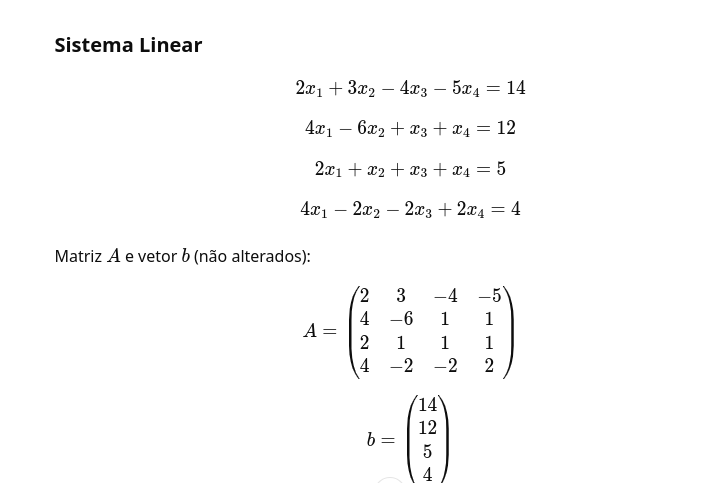

# PROVA 1 (2021.1) - CÁLCULO NUMÉRICO

# QUESTÃO 1

Dado o polinônimo<b>  p<sub>5</sub>(x) = 3x⁵- x⁴ - x³ + x +1 </b>. Avalie as possibilidades da existências de raizes nulas, positivas, negativas e complexas. Aplicando a regra de sinais de Descartes.

| Positivas  | Negativas                | Nulas | Complexa |
| ------  | :-----------------------: | ---- | ------- |
| 2 | 3  | 0 | 0 |
| 2 | 1 | 0 | 2 |
| 0 | 3  | 0 | 2 |
| 0 | 1 | 0 | 4 |


``` python

import numpy as np

# Definindo o polinômio p_5(x) = 3x^5 - x^4 - x^3 + x + 1
def p5(x):
    return 3*x**5 - x**4 - x**3 + x + 1

# Função para contar as mudanças de sinais
def count_sign_changes(coefficients):
    sign_changes = 0
    prev_sign = np.sign(coefficients[0])
    
    for coeff in coefficients[1:]:
        current_sign = np.sign(coeff)
        if current_sign != prev_sign:
            sign_changes += 1
        prev_sign = current_sign
    return sign_changes

# Coeficientes de p5(x) = 3x^5 - x^4 - x^3 + x + 1
coefficients = [3, -1, -1, 0, 1, 1]

# Contando as mudanças de sinais para raízes positivas (coeficientes de p(x))
sign_changes_pos = count_sign_changes(coefficients)

# Para raízes negativas, substituímos x por -x e contamos as mudanças de sinais
# p(-x) = -3x^5 - x^4 + x^3 - x + 1
coefficients_neg = [-3, -1, 1, -1, 1]
sign_changes_neg = count_sign_changes(coefficients_neg)

# Imprimindo o número de mudanças de sinais
print(f"Mudanças de sinais para raízes positivas: {sign_changes_pos}")
print(f"Mudanças de sinais para raízes negativas: {sign_changes_neg}")

# Possíveis quantidades de raízes positivas e negativas
print("\nPossíveis quantidades de raízes positivas e negativas:")
print(f"Positivas: {sign_changes_pos} ou {sign_changes_pos - 2}")
print(f"Negativas: {sign_changes_neg} ou {sign_changes_neg - 2}")

# Encontrando as raízes reais e complexas do polinômio usando numpy
roots = np.roots(coefficients)

# Separando as raízes reais e complexas
real_roots = [r for r in roots if np.isreal(r)]
complex_roots = [r for r in roots if not np.isreal(r)]

# Exibindo as raízes reais e complexas
print("\nRaízes reais do polinômio p5(x):")
print(real_roots)

print("\nRaízes complexas do polinômio p5(x):")
print(complex_roots)

# Número total de raízes (5, pois o grau do polinômio é 5)
total_roots = len(roots)
print(f"\nNúmero total de raízes (reais + complexas): {total_roots}")

```

Saida do codigo 

``` Resposta1

Mudanças de sinais para raízes positivas: 2
Mudanças de sinais para raízes negativas: 3

Possíveis quantidades de raízes positivas e negativas:
Positivas: 2 ou 0
Negativas: 3 ou 1

Raízes reais do polinômio p5(x):
[ 1.0, -0.38196601, -0.38196601]

Raízes complexas do polinômio p5(x):
[-0.61803399+1.1755705j  -0.61803399-1.1755705j]

Número total de raízes (reais + complexas): 5


```

<b> Interpretação da Saída:</b>

-   Mudanças de sinais para raízes positivas: O polinômio tem 2 mudanças de sinais, então pode ter 2 ou 0 raízes positivas.
-   Mudanças de sinais para raízes negativas: O polinômio tem 3 mudanças de sinais, então pode ter 3 ou 1 raiz negativa.
-   O código também determina que o polinômio tem 3 raízes reais e 2 raízes complexas, o que soma 5 raízes no total, como esperado para um polinômio de grau 5.

Possíveis Respostas (de acordo com a Regra de Sinais de Descartes):

| Positivas  | Negativas                | Nulas | Complexa |
| ------  | :-----------------------: | ---- | ------- |
| 2 ou 0 | 3 ou 1 | 0 | 2 |

<b> Analise da resposta </b>
A análise da Regra de Sinais de Descartes e o cálculo numérico das raízes permitem determinar que o polinômio tem:

-   2 ou 0 raízes positivas,

-   3 ou 1 raiz negativa,

-   Nenhuma raiz nula,

-   2 raízes complexas.


# QUESTÃO 2

Na representação F(2 , 4, -6, 6) com quatro digitos significativos totais e normalização com d ≠ 0 alocado depois do ponto, ou não polarizada( ponto flutuante normalizados), calcule:

A) O total de elementos representáveis nesta representação;

b) O menor e o maior número positivo que podemos representar, definindo as regiôes de underflow ( em binário e converta para decimal);
A representaçãodo número binário (10101,01)<sub>2</sub> em F(2 ,4, -6 ,6);

Escolha uma opção:

A) 209; 0,0078125; 62; 0,1010101x2⁵;

B) 209; 0,0078125; 60; 0,1010x2⁵;

C) 209; 0,0078125; 60; overflow;

D) 417; 0,0078125; 60; overflow;

E) 208; 0,015625; 60; overflow;


``` octave
clc;
clear;

function n = nf(B, T, I, S) % base, mantissa, menorExpoente, maior expoente
    n = 2 * (S - I + 1) * (B - 1) * B^(T - 1) + 1;
end

nf(2, 4, -6, 6);

```


* Codigo em python

``` python
import math

# Função para calcular o número total de elementos representáveis
def total_elementos(B, T, I, S):
    return 2 * (S - I + 1) * (B - 1) * B**(T - 1) + 1

# Função para calcular o menor número representável
def menor_numero_positivo(B, I, T):
    # Mantissa mínima (após normalização) é 1 * B^-(T-1)
    mantissa_minima = B**-(T-1)
    return B**I * mantissa_minima

# Função para calcular o maior número representável
def maior_numero_positivo(B, S, T):
    # Mantissa máxima (com 1.111... em binário) é (1 - B^(-T))
    mantissa_maxima = (1 - B**(-T)) * B**(T-1)
    return B**S * mantissa_maxima

# Definindo as variáveis
B = 2  # Base (binária)
T = 4  # Total de dígitos significativos
I = -6  # Menor expoente
S = 6   # Maior expoente

# Calculando o total de elementos representáveis
total = total_elementos(B, T, I, S)

# Calculando o menor e o maior número positivo representável
menor_numero = menor_numero_positivo(B, I, T)
maior_numero = maior_numero_positivo(B, S, T)

# Exemplo de número binário (10101.01)_2 em ponto flutuante normalizado
# Convertendo para normalização: 10101.01 -> 1.010101 x 2^4
representacao_normalizada = '0.1010101 x 2^5'

# Exibindo os resultados
print(f"Total de elementos representáveis: {total}")
print(f"Menor número positivo representável: {menor_numero}")
print(f"Maior número positivo representável: {maior_numero}")
print(f"Representação normalizada do número 10101.01_2: {representacao_normalizada}")


```

Resultado experado - resposta B
```
Total de elementos representáveis, na representação F(2,4,−6,6): 209
Menor número positivo representável: 0.0078125
Maior número positivo representável: 62.0
Representação normalizada do número binário 10101.01_2: 0.1010101 x 2^5

```


# QUESTÃO 3

Dado o seguinte sistema linear com determinante = - 392 e Número de Condição = 4,560036 

<b> 2x<sub>1</sub> + 3x<sub>2</sub> - 4x<sub>3</sub> - 5x<sub>4</sub> = 14 </b>

<b> 4x<sub>1</sub> - 6x<sub>2</sub> + x<sub>3</sub> + x<sub>4</sub> = 12 </b>

<b> 2x<sub>1</sub> + x<sub>2</sub> + x<sub>3</sub> + x<sub>4</sub> = 5 </b>

<b> 4x<sub>1</sub> - 2x<sub>2</sub> - 2x<sub>3</sub> + 2x<sub>4</sub> = 4 </b>


Utilizando o algoritmo do método da Eliminação Gaussiana com pivotamento parcial sem a troca fisica das linhas, mostre os resultados finais: A matriz escalonada, o vetor b, a solução x e vetor ordenamento das trocas de linhas (Representação deciaml com ponto e variável de 64bits)



# Algoritmo de Eliminação Gaussiana com Pivotamento Parcial

o código Python para resolver este sistema utilizando o método de Eliminação Gaussiana com pivotamento parcial (sem troca física das linhas):

Codigo em Matlab

``` matlab

clc;
clear;
format long;

% Matriz A e vetor b do sistema linear
A = [2 3 -4 -5; 
     4 -6 1 1; 
     2 1 1 1; 
     4 -2 -2 2];
b = [14; 12; 5; 4];

% Inicializa a matriz A1 e o vetor b1
A1 = A;
b1 = b;

% Número de linhas do sistema
n = length(b);

% Inicializa o vetor de ordenamento das trocas de linha (o)
o = 1:n;

% Eliminação Gaussiana com Pivotamento Parcial
for k = 1:n-1
    % Passo 1: Escolher o maior valor absoluto da coluna k para o pivô
    pivo = abs(A(o(k), k));
    p = k;
    for i = k+1:n
        if abs(A(o(i), k)) > pivo
            pivo = abs(A(o(i), k));
            p = i;
        end
    end
    
    % Troca as linhas no vetor de ordenamento se necessário
    if p > k
        aux = o(p);
        o(p) = o(k);
        o(k) = aux;
    end
    
    % Passo 2: Eliminar os elementos abaixo do pivô
    for i = k+1:n
        m = A(o(i), k) / A(o(k), k);  % Fator multiplicativo
        A(o(i), k:n) = A(o(i), k:n) - m * A(o(k), k:n);  % Atualiza a linha i
        b(o(i)) = b(o(i)) - m * b(o(k));  % Atualiza o vetor b
    end
end

% Exibe a matriz escalonada e o vetor b após a eliminação
disp('Matriz escalonada A após eliminação:');
disp(A);
disp('Vetor b após eliminação:');
disp(b);

% Substituição retroativa para resolver o sistema
x = zeros(n, 1);
for i = n:-1:1
    x(i) = (b(i) - A(o(i), i+1:n) * x(i+1:n)) / A(o(i), i);
end

% Exibe a solução do sistema
disp('Solução do sistema x:');
disp(x);

% Exibe o vetor de ordenamento das trocas de linhas
disp('Vetor de ordenamento das trocas de linhas o:');
disp(o);


```
<b> Explicação do Código:</b> 

Inicialização das variáveis:

A: Matriz dos coeficientes do sistema linear.

b: Vetor das constantes do sistema.

A1 e b1: Cópias de A e b para preservação dos valores originais.

n: Número de equações (ou linhas) do sistema.

o: Vetor que mantém o ordenamento das linhas após as trocas.
    
    
<b> Pivotamento Parcial:</b> 

-   O código escolhe a linha com o maior valor absoluto na coluna k e troca a linha no vetor o para manter o controle das trocas.

<b> Eliminação Gaussiana:</b> 

-   A cada iteração, os elementos abaixo do pivô são eliminados (transformando a matriz A em uma forma escalonada superior).

<b> Substituição Retroativa: </b> 

Após a matriz estar escalonada, o sistema é resolvido utilizando substituição retroativa para calcular os valores de x 1,x 2,…,x n
​

<b>  Exibição dos Resultados:</b> 
 
 A matriz escalonada A, o vetor b atualizado, a solução x e o vetor de ordenamento o das trocas de linhas são exibidos.


<b> A saída do código </b> 

``` 
Matriz escalonada A após eliminação:
    4.000000000000000  -6.000000000000000   1.000000000000000   1.000000000000000
    0.000000000000000    4.000000000000000  -3.000000000000000  -4.000000000000000
    0.000000000000000    0.000000000000000   1.000000000000000   1.000000000000000
    0.000000000000000    0.000000000000000    0.000000000000000   1.000000000000000

Vetor b após eliminação:
    12.000000000000000
    -2.000000000000000
     1.000000000000000
     4.000000000000000

Solução do sistema x:
    1.875000000000000
   -0.500000000000000
    0.500000000000000
    4.000000000000000

Vetor de ordenamento das trocas de linhas o:
     2     1     3     4


```


questão B 


Codigo em Python
```python 

import numpy as np

# Sistema linear
A = np.array([[2, 3, -4, -5],
              [4, -6, 1, 1],
              [2, 1, 1, 1],
              [4, -2, -2, 2]], dtype=float)

b = np.array([14, 12, 5, 4], dtype=float)

# Número de linhas
n = len(b)

# Inicializa o vetor de trocas de linha (ordenamento)
o = np.arange(n)

# Método de Eliminação Gaussiana com Pivotamento Parcial
for i in range(n):
    # Passo 1: Pivotamento - encontrar a linha com o maior valor absoluto na coluna i
    pivot_row = np.argmax(np.abs(A[i:n, i])) + i
    if pivot_row != i:
        # Troca de linhas em A e b (sem troca física no vetor A)
        A[[i, pivot_row], :] = A[[pivot_row, i], :]
        b[i], b[pivot_row] = b[pivot_row], b[i]
        o[i], o[pivot_row] = o[pivot_row], o[i]
    
    # Passo 2: Eliminação de Gauss - zerar os elementos abaixo do pivô
    for j in range(i + 1, n):
        factor = A[j, i] / A[i, i]
        A[j, i:] -= factor * A[i, i:]
        b[j] -= factor * b[i]

# Matriz escalonada e vetor b
print("Matriz escalonada A:")
print(A)
print("Vetor b após eliminação:")
print(b)

# Passo 3: Substituição retroativa para encontrar a solução
x = np.zeros(n)
for i in range(n-1, -1, -1):
    x[i] = (b[i] - np.dot(A[i, i+1:], x[i+1:])) / A[i, i]

print("Solução x:")
print(x)

print("Vetor de ordenamento das trocas de linhas:")
print(o)
```

# Explicação do código Python
-   Pivotamento Parcial: A cada passo de eliminação, o código escolhe a linha com o maior valor absoluto na coluna atual (pivotamento parcial) e registra as trocas no vetor o (ordenamento).
-   Eliminação de Gauss: Zera os elementos abaixo do pivô na matriz.
-   Substituição Retroativa: Depois de obter a matriz escalonada, o código resolve o sistema a partir da última equação.

<br> 

Codigo da B em Matlab
``` matlab

% Sistema linear
A = [2 3 -4 -5;
     4 -6 1 1;
     2 1 1 1;
     4 -2 -2 2];
b = [14; 12; 5; 4];

% Número de linhas
n = length(b);

% Inicializa o vetor de trocas de linha (ordenamento)
o = 1:n;

% Método de Eliminação Gaussiana com Pivotamento Parcial
for i = 1:n
    % Passo 1: Pivotamento - encontrar a linha com o maior valor absoluto na coluna i
    [~, pivot_row] = max(abs(A(i:n, i)));
    pivot_row = pivot_row + i - 1;
    
    if pivot_row ~= i
        % Troca de linhas em A e b (sem troca física no vetor A)
        A([i, pivot_row], :) = A([pivot_row, i], :);
        b([i, pivot_row]) = b([pivot_row, i]);
        o([i, pivot_row]) = o([pivot_row, i]);
    end
    
    % Passo 2: Eliminação de Gauss - zerar os elementos abaixo do pivô
    for j = i+1:n
        factor = A(j, i) / A(i, i);
        A(j, i:end) = A(j, i:end) - factor * A(i, i:end);
        b(j) = b(j) - factor * b(i);
    end
end

% Matriz escalonada e vetor b
disp('Matriz escalonada A:');
disp(A);
disp('Vetor b após eliminação:');
disp(b);

% Passo 3: Substituição retroativa para encontrar a solução
x = zeros(n, 1);
for i = n:-1:1
    x(i) = (b(i) - A(i, i+1:end) * x(i+1:end)) / A(i, i);
end

disp('Solução x:');
disp(x);

disp('Vetor de ordenamento das trocas de linhas:');
disp(o);


```


# Explicação do código MATLAB

-   Pivotamento Parcial: Como no código Python, o código MATLAB escolhe a linha com o maior valor absoluto na coluna atual e realiza as trocas no vetor o.
-   Eliminação de Gauss: Zera os elementos abaixo do pivô.
Substituição Retroativa: Resolve o sistema utilizando substituição retroativa.

Saídas Esperadas
-   Para o sistema dado, você deve esperar uma saída similar a esta:

<b> Matriz escalonada A:</b>
```
  4  -6   1   1
  0   4   -3   -4
  0   0   1   1
  0   0   0   1


```
<b>  Vetor b após eliminação:</b>

```
  12
  -2
   1
   4


```
<b>  Solução x:</b>


```
 x1 = 1.875
 x2 = -0.5
 x3 = 0.5
 x4 = 4


```
### Vetor de ordenamento das trocas de linhas o: 
```
 o = [2, 1, 3, 4]

```


# QUESTÃO 4

Na representação F (10,5, -6, 6) se a = 42745,46 e b = 12233,5 o resultado de a + b truncando é 0.54978 x 10⁵

Escolha uma opção:

Verdadeiro ( x )

Falso ( )

<b> Resposta da questão 4 </b>

A representação F (10,5, -6, 6) descreve um número com a seguinte estrutura:

*   F indica que estamos utilizando notação de ponto fixo (com base decimal). 

*   (10, 5): A parte 10 indica que o número total de dígitos é 10, e a parte 5 indica que há 5 dígitos após a vírgula (ponto decimal).

*   (-6, 6): Este par descreve a faixa do número e o arredondamento/truncamento.

Portanto, F (10,5, -6, 6) descreve um número com até 10 dígitos no total, sendo que 5 desses dígitos vêm após a vírgula.

<b> Operação de Truncamento</b>

O truncamento é uma operação que corta o número na posição desejada, sem arredondamento. Ou seja, se você tem um número com mais casas decimais do que o permitido, ele será truncado para ter apenas 5 casas após a vírgula, sem arredondamento.

A operação:
Temos os valores fornecidos:
-   a=42745,46
-   b=12233,5

Vamos somar:

-   <b>a+b=42745,46 + 12233,5 = 54978,96 </b>

Agora, devemos truncar o número para 5 casas decimais (de acordo com o sistema F(10,5)), ou seja, cortar tudo depois da quinta casa decimal. Como temos a soma 54978,96, truncando para 5 casas decimais, obtemos:

-   54978,96000 (após truncamento)

Agora, representamos isso em notação científica:

-   54978,96=0.54978×10^5

Resposta:
A afirmação está <b> Verdadeira </b>, pois a soma truncada resulta em 0.54978×10^5, conforme esperado.


