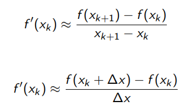
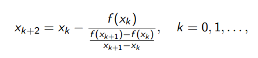

# Método das secantes

Continuando no estudo de métodos de linearização, vimos como utilizar o método de Newton, mas ele tem um problema que em alguns casos pode ser impedimento para que o método seja utilizado. Ao usar esse algoritmo precisamos sempre conhecer a derivada da função `f(x)` presente na equação. Vamos ver agora um outro método chamado método das secantes que resolve esse problema utilizando uma aproximação razoável para a derivada.

## Definição formal de derivada

Pela definição formal de uma derivada temos:

É possível retirar o limite dai, desde que a gente pense em uma aproximação

Dessa forma a derivada numérica passa a depender apenas de dois pontos, da seguinte forma:

E se substituirmos essa aproximação na relação de recorrência que tinhamos utilizado para o método de newton, chegamos a uma nova relação dada por:

