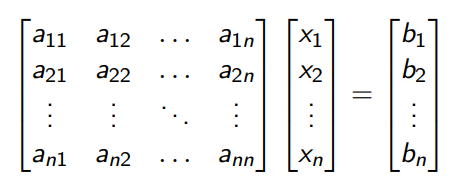

# Resolução de sistemas lineares

Primeiramente, vamos relembrar o que é um sistema linear. Podemos considerar como um sistema linear, toda expressão do tipo:

Ou então, podemos representar ele de forma matricial (o que será feito nessa disciplina para facilitar os trabalhos programaticamente):

Lembrando que por estarmos falando no momento de sistemas lineares, todas as equações são da forma `ax + b`.

## Resolvendo sistemas lineares

É considerada uma solução para um sistema linear, uma matriz S tal que `AS = B`, partindo de um sistema representado por matrizes do tipo `AX = B`. Dito isto, existem diversas maneiras de resolver e elas se encaixam em 3 grupos principais.

1. Métodos eliminativos (diretos)

    Aqui transformamos a matriz A em uma matriz mais simples, preservando a solução S.

2. Métodos iterativos

    Começamos com uma matriz candidata X⁰ para S, e então geramos uma sequência Xⁿ, com n = (1, 2, ...), cujo limite (se existir) é S.

3. Métodos de otimização

    Geramos uma função matricial F(X) = Xt * AX - 2BtX e buscamos o seu mínimo, que é da forma A⁻¹B, ou seja, a solução S do nosso sistema linear.

## Solubilidade de sistemas lineares

Sistemas podem ser classificados quanto a sua solubilidade, em geral temos:

1. Sistemas possíveis e com solução determinada

Sistemas resolvíveis e que possuem uma única solução

2. Sistemas possíveis e sem solução determinada

Sistemas resolvíveis mas que possuem infinitas soluções

3. Sistemas impossíveis

Sistemas não resolvíveis