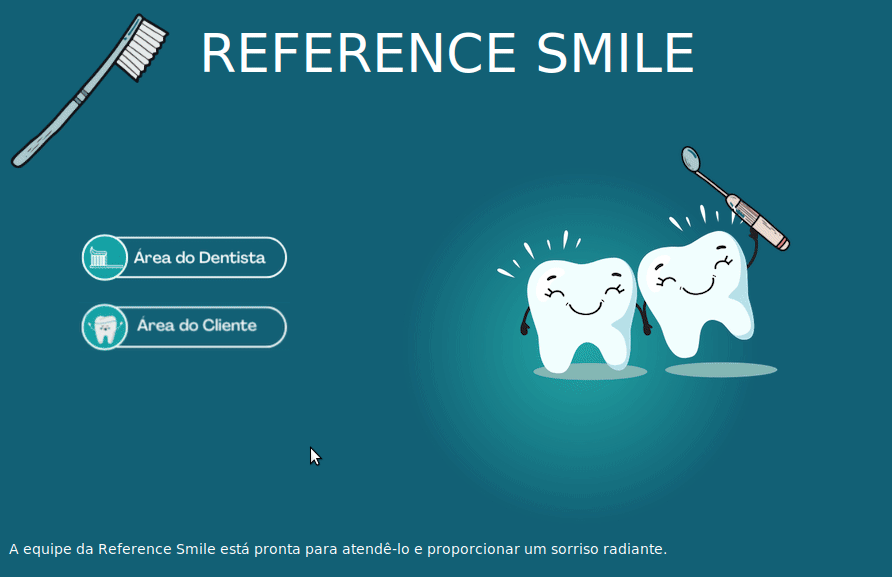
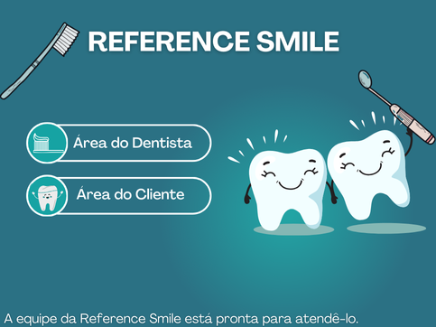

# Agenda - REFERENCE SMILE!
Esta Aplicação foi realizado como Projeto Final da disciplina Programação Orientada a Objetos I - Universidade Federal de Santa Catarina. O projeto foi feito com linguagem Python e Tinker.


<div align="center">
    <div style="display: flex; align-items: center;">
        
    </div>
</div>


## Reference Smile - Sistema de agendamentamento para consultas dentárias

Reference Smile é um sistema para gerenciamento de consultas dentárias, onde dentistas podem informar seus horários e visualizar suas agendas e clientes podem agendar suas consultas.

### Tela 1 - Tela de Início


<div align="center">
    <div style="display: flex; align-items: center;">
        
    </div>


<br> 
A tela de inicial é o primeiro contato do usuário com a aplicação. O usuário vai identificar como cliente ou como dentista. Caso ele se identifica como dentista ele vai se encaminhado para pagina do dentista. Caso contrario ele vai se encaminhado para pagina do cliente para agendar as consultas.

## Tecnologias Utilizadas:
- Lógica de Programação: Python e Programação Orientada de Objetos.
- Interface Gráfica: Tkinter para criação das telas de interação com o usuário.

## Como rodar
O sistema foi desenvolvido com a linguagem Python utilizando a biblioteca Tkinter. Para rodar, pode se executar o comando
```bash
make run
```
ou

```
python3 main.py
```

Observação: Todas as datas do sistema estão no formato ANO-MES-DIA. Exemplo: 2024-01-01