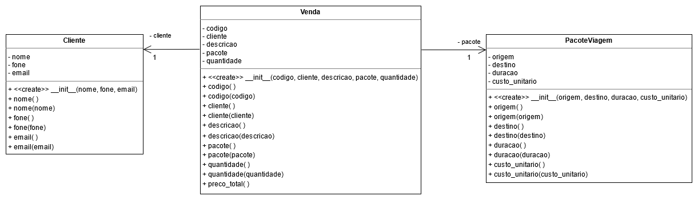

<h1 align="center">
  <strong> 👩‍💻 Atividade 3</strong>
</h1>

Descrição:

É importante para uma agência de viagens manter as informações de seus pacotes vendidos, como: origem, destino, duração, preço do pacote e seus clientes.

Além disso, é importante que cada venda possa calcular o seu preço total (quantidade de pacotes contratados multiplicado pelo preço do pacote).

Veja aqui o diagrama  que representa a solução do problema.

Implemente todos os métodos e atributos exatamente como definido no diagrama.

IMPORTANTE:

Retire nomes de pacotes das classes antes de submeter;
Retire acentos e caracteres especiais antes de submeter;
Leia atentamente as mensagens de erro.

