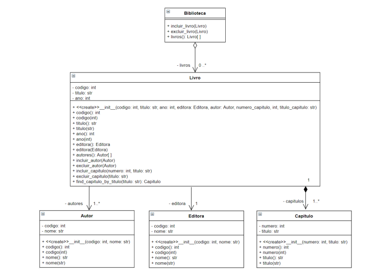
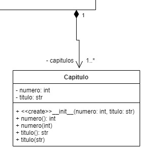
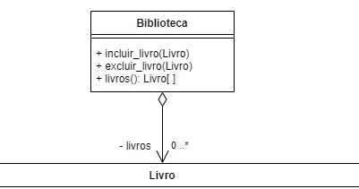

### Exercício 04: Relações Entre Objetos
- Abstração, associação, agregação, composição e manipulação de listas.

- Implemente a parte de um projeto simplificado para uma biblioteca que observe a especificação ```abaixo```.

**Figura de Diagrama em UML*.


<br> <b>
#### Considerações
</b>

a) Todas as operações especificadas nas classes devem ser implementadas;

b) Devem ser verificados/garantidos os tipos inseridos nas listas de autores, capítulos, livros, etc., nas classes;

c) Os métodos ```incluir_autor```, ```excluir_autor``` devem verificar caso o autor informado como parâmetro seja nulo ou o autor já esteja vinculado ao livro;

d) Os métodos ```incluir_livro``` e ```excluir_livro``` devem verificar caso o livro já esteja na biblioteca ou seja nulo;

e) Os métodos ```incluir_capitulo``` e ```excluir_capitulo``` devem verificar caso o capítulo (definido por mesmo título) já consta no livro ou a tentativa de excluir um capítulo inexistente.

#### Importante
No exercicio 4 - foram usadas dois relacionamentos o agregação e composição 

### Relacionamento entre classes


 - **Herança (Generalização)**: Representada por uma linha sólida com um triângulo aberto na ponta, indicando que uma classe filha herda de uma classe pai.

```──────────▷```
 - **Realização**: Uma linha tracejada com um triângulo aberto, mostrando que uma classe implementa uma interface. 

```─ ─ ─ ─ ─ ─▷```
 - **Composição**: Uma linha sólida com um losango preenchido na ponta, indicando uma relação "parte-todo" forte, onde a parte não pode existir sem o todo. 

```──────────◆```
 - **Agregação**: Uma linha sólida com um losango aberto, representando uma relação "parte-todo" mais fraca, onde a parte pode existir independentemente do todo. 

```──────────◇```
 - **Associação**: Uma linha sólida simples, que pode ter setas para indicar a direção da navegação, mostrando que as classes estão relacionadas. 

```──────────```
 - **Dependência**: Uma linha tracejada com uma seta, indicando que uma classe depende temporariamente de outra. 

```- - - - ->```

Esses conectores ajudam a visualizar a estrutura e as interações entre as classes no sistema.

#

### Composição entre Livro e Capítulo

A composição em Python é uma relação entre duas classes em que uma classe "contém" outra, ou seja, um objeto de uma classe é responsável por instanciar e gerenciar objetos de outra classe. Essa relação é chamada de composição forte, pois se o objeto "contido" ou dependente só existe enquanto o objeto principal existir. Se o objeto principal for apagado, o objeto contido também será, pois ele depende do objeto principal para existir.



<br>

Um Capítulo não faz sentido existir fora de um Livro. Se o Livro for destruído, seus Capítulos também serão. Isso representa a composição, onde o objeto "parte" (Capítulo) só existe enquanto o objeto "todo" (Livro) existir.

```python
class Capitulo:
    def __init__(self, numero: int, titulo: str):
        self.__numero = numero
        self.titulo = titulo

    @property
    def numero(self):
        return self.__numero

    @numero.setter
    def numero(self, numero):
        self.__numero = numero

    @property
    def titulo(self):
        return self.__titulo

    @titulo.setter
    def titulo(self, titulo):
        self.__titulo = titulo

 ```

Explicação:

* Classe Capitulo: Representa um capítulo de um livro. Tem dois atributos, numero e titulo.

* Classe Livro: Contém uma lista de capítulos. A função adicionar_capitulo cria novos capítulos e os adiciona à lista capitulos.

* Quando criamos um objeto Livro, podemos adicionar capítulos a ele. Os capítulos só existem como parte do livro.

* Se o livro for deletado (com del meu_livro), todos os capítulos também são destruídos, pois eles só existem como parte do livro.

#
### Agregação entre Livro e Biblioteca

A <b>agregação</b> é um tipo de relação entre classes onde uma classe "possui" ou "usa" outra classe como parte de si, mas ambas podem existir independentemente. Diferente da composição, na agregação, se o objeto "contedor" for destruído, o objeto "contido" ainda pode existir por si só.




<br>

A <b>Biblioteca</b> não é "dona" dos Livros. Os Livros podem existir independentemente da Biblioteca, e podem ser usados em outras partes do programa, ou até ser adicionados a outras bibliotecas.

```python

from livro import Livro


class Biblioteca:
    def __init__(self):
        self.__livros = []

    def incluir_livro(self, livro: Livro):
        if isinstance(livro, Livro):
            tem_livro = False
            for livro_for in self.__livros:
                if livro_for.codigo == livro.codigo:
                    tem_livro = True
            if not tem_livro:
                self.__livros.append(livro)  # append para incluir

    def excluir_livro(self, livro: Livro):
        self.__livros.remove(livro)  # tera que testar

    @property
    def livros(self):
        return self.__livros

 ```

<b> Classe Livro: </b>

* Representa um livro com um título, autor e código.
* Os livros são objetos independentes que podem ser criados e usados independentemente de qualquer biblioteca.

<b> Classe Biblioteca:</b> 

* A Biblioteca tem um nome e contém uma lista de livros. No entanto, ela apenas "agrega" os livros, e não os "possui" no sentido de dependência.
* O método incluir_livro permite agregar (adicionar) livros à lista da biblioteca.
* O método excluir_livro remove um livro da lista da biblioteca.
* O método listar_livros imprime todos os livros atualmente agregados à biblioteca.

<b> Agregação:</b> 

A biblioteca agrega os livros em sua lista, mas eles podem existir fora dela. Se a biblioteca for destruída, os livros continuam existindo, pois não dependem dela para sua existência.
