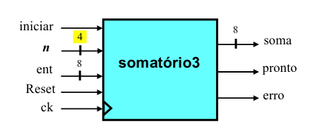
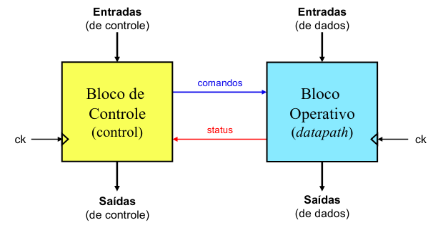
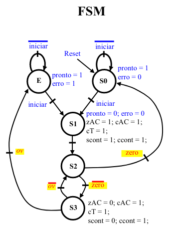
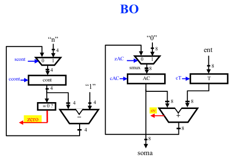

### LABORATORIO - SISTEMA DIGITAL

# 
### Pequenas Práticas: Sistema digital Somador multiciclo das aulas teóricas 3T e 4T

Descrição: Descrever em VHDL  o sistema digital que corresponde ao somador multiciclo (exemplo 3) construído a partir dos conteúdos das aulas 3T e 4T (ver imagens abaixo).O funcionamento desse circuito já deve ser conhecido e pode ser revisto com base nos materiais das aulas teóricas.

Especificação das interfaces: Necessita-se de um sistema digital (SD) dedicado (i.e., um bloco acelerador) capaz de realizar o somatório den números inteiros sem sinalA, B, C,D...,, representados em binário com WIDTH_ENT bits, onde0< n<= NUM_VALS. Este sistema digital, doravante denominado de “somatório3”, possui uma entrada de relógio (“ck”), uma entrada de reset assíncrono (“reset”), uma entrada de dados com WIDTH_ENT bits (“ent”), uma entrada para receber o valor n, uma entrada de controle denominada “iniciar”, duas saídas de controle (“pronto” e “erro”) e uma saída de dados de WIDTH_ENT bits (“soma”).

Atenção: Em todas as figuras aparece a largura fixa de 8 e 4 bits, mas você deve projetar um somador genérico de "WIDTH_ENT" bits.



Para a descrição VHDL desse sistema digital você precisará descrever o sistema todo (somadorMulticiclo4T.vhd), que é composto por um bloco de controle (blocoControle4T.vhd) e um bloco operativo (blocoOperativo4T), conforme o modelo BO/BC apresentado na aula teórica 4T (ver imagens abaixo). Você também precisará descrevefr cada um dos componentes do bloco operativo. OBS: No bloco operativo, conecte a saída "ov" do circuito ao "carryout" do somador, e não ao "overflow".

Em adição à especificação das entidades, vários trechos da arquitetura de alguns arquivos já vem com algum código escrito, para ajudá-lo nesta primeira atividade prática envolvendo um sistema digital, e esses códigos não precisam ser alterados. 

*Fique atento a algumas restrições nesta avaliação prática:

*   Você não pode alterar a entidade de nenhum arquivo;
*   Não pode utilizar comandos sequenciais  para descrever circuitos combinacionais (com exceção da lógica de próximo estado de FSMs);
*   Deve seguir todas as orientações de codificação e construções do VHDL vistas nas aulas práticas.
*   Você pode solicitar a avaliação 3 vezes sem ter desconto na nota. A partir disso você receberá desconto de 10% a cada nova tentativa de avaliação.   
*  Portanto, recomenda-se fortemente que você descreva seu sistema no Quartus, simule no ModelSim, e quando achar que estiver funcionando, copie para a atividade no Moodle. Além disso, você pode mandar executar o código no moodle sem mandar avaliar.

Fique atento também a algumas coisas novas que aparecem nos códigos VHDL:

*   A declaração do package BC_State permite que um tipo de dados novo (State) seja utilizado na entidade. Isso foi feito para ajudar nos seus testes, externalizando o estado atual da FSM do Bloco de Controle.
*   O "begin" na entity permite que uma assertiva seja incluída na própria entity. Isso permite validar opções passadas pelo projetista via "generic". 
A palavra reservada "open", usada num dos arquivos, indica que a saída do componente não é usada e fica desconectada (aberta).






Além do projeto do sistema digital, você precisará testá-lo. Para isso, complete o testbench chamado tsd.vht, que instancia seu circuito e que deve gerar estímulos aos sinais de entrada, da seguinte forma:

*   No pulso 0, coloque o "reset" em '1' e no demais pulsos, em '0';
*   A cada pulso de clock gere um valor aleatório de WIDTH_ENT bits e o coloque no sinal "ent".
*   Se o sinal "pronto" for '1' e o sinal "reset" for 0, então coloque o "iniciar" em '1' e gere um valor aleatório de WIDTH_N bits em "n"; senão coloque "iniciar" em 0;

O testbench também deve ter o parâmetro genérico "LATENCY" ajustado para o menor múltiplo de 5 ns que permita o atendimento a todas as restrições temporais do circuito quando implementado na FPGA family "Cyclone IV E" e target device "Auto device selected by filter", que é a mesma especificada desde a aula prática 1P. Você deve descobrir o menor período do clock que atende as restrições temporais utilizando o "Timing Analizer".

A correção do testbench é manual e será feita pelo professor após o prazo final de entrega desta atividade. A nota atribuída automaticamente é apenas uma estimativa máxima da nota (dada pelo funcionamento do circuito), mas mesmo se o circuito funcionar ainda pode haver desconto de até 3 pontos na nota por erros na especificação do testbench (estímulos aos sinais de entrada ou latência do circuito) que forem detectados em sua correção manual.

#
O projeto solicitado descreve um somador multiciclo em VHDL, baseado no modelo BO/BC (bloco operativo/bloco de controle) apresentado nas aulas 3T e 4T. Esse somador deve ser capaz de somar múltiplos números inteiros binários de largura genérica WIDTH_ENT, controlado por um FSM (Finite State Machine) que coordena as operações de controle e execução.

Aqui está uma explicação detalhada da implementação:

Estrutura do Código
1. Entidade Principal (somadorMulticiclo4T)
Esta entidade descreve o somador multiciclo, com parâmetros de entrada e saída, incluindo:

*   Entradas: ck (clock), reset, iniciar, ent (número a ser somado), n (quantidade de números a somar).
*   Saídas: erro, pronto e soma.
*   Teste: O estado do controle é externamente acessível via stateBC.


2. Bloco Operativo (blocoOperativo4T)
Este componente realiza a operação de soma em cada ciclo de clock, controlado pelos sinais de comando do bloco de controle:

*   O bloco de controle instrui o bloco operativo a carregar, somar e verificar condições.
*   Os sinais de controle como scont, ccont, zAC etc., são responsáveis por coordenar as operações.

3. Bloco de Controle (blocoControle4T)
A FSM gerencia o ciclo de execução da soma. Ele possui quatro estados principais:

*   S0: Estado de repouso. Se iniciar = '1', transita para S1.
*   S1: Carregamento e início da operação.
*   S2: Execução da soma, verificando se zero = '1' (condição de término).
*   S3: Continuação da soma, verificando se houve overflow (representado por ov).
E: Estado de erro, ativado quando ov = '1'.

Cada transição de estado é regida pelo estado atual e pelos sinais de controle.

4. Sinais de Controle
*   O FSM coordena as operações com os sinais de controle (scont, ccont, zAC, etc.).
*   Os sinais de erro e conclusão (erro, pronto) são ativados conforme o estado do FSM.

# Explicação do Bloco de Controle( Control ) and Bloco Operativo (datapath)


* A implementação será dividida em três partes principais: a entidade principal (somadorMulticiclo4T), o bloco de controle (blocoControle4T) e o bloco operativo (blocoOperativo4T).

1. Entidade Principal: somadorMulticiclo4T

A entidade principal é responsável por integrar os componentes de controle e operação, além de definir as entradas e saídas do sistema.

```
library ieee;
use ieee.std_logic_1164.all;
use ieee.numeric_std.all;

```

*   library ieee;: Inclui a biblioteca IEEE, que contém tipos de dados e funções padrão utilizados em VHDL.
*   use ieee.std_logic_1164.all;: Permite o uso do tipo std_logic, que é um tipo de dado usado para representar sinais digitais.
*   use ieee.numeric_std.all;: Permite o uso de tipos de dados numéricos, como operações aritméticas e conversões


2. Definição da Entidade 
```
entity somadorMulticiclo4T is
    generic (
        WIDTH_ENT : positive;  -- Largura da entrada de dados
        WIDTH_N   : positive   -- Largura do valor n
    );
    port (
        ck      : in std_logic;                       -- Clock
        reset   : in std_logic;                       -- Reset assíncrono
        iniciar : in std_logic;                       -- Sinal para iniciar a soma
        ent     : in std_logic_vector(WIDTH_ENT - 1 downto 0);  -- Entrada de dados
        n       : in std_logic_vector(WIDTH_N - 1 downto 0);     -- Valor n
        pronto   : out std_logic;                     -- Sinal de pronto
        erro    : out std_logic;                      -- Sinal de erro
        soma    : out std_logic_vector(WIDTH_ENT - 1 downto 0)  -- Resultado da soma
    );
end entity;

```
entidade. Aqui, WIDTH_ENT define a largura da entrada de dados e WIDTH_N define a largura do número de entradas a serem somadas.

*   port (...): Define as portas de entrada e saída da entidade:
    *   ck: Sinal de clock.
    *   reset: Sinal de reset assíncrono.
    *   iniciar: Sinal que indica quando iniciar a soma.
    *   ent: Vetor de entrada que contém os dados a serem somados.
    *   n: Vetor que indica quantas entradas devem ser somadas.
    *   pronto: Sinal de saída que indica que a soma foi concluída.
    *   erro: Sinal de saída que indica se ocorreu um erro.
    *   soma: Vetor de saída que contém o resultado da soma.

3. Arquitetura Estrutural
``` architecture structural of somadorMulticiclo4T is
    signal stateBC: state;  -- Estado do controle
    signal scont, ccont, zAC, cAC, cT: std_logic; -- Sinais de controle
```

*   architecture structural of somadorMulticiclo4T is: Define a arquitetura da entidade como structural, indicando que a implementação será baseada na interconexão de componentes.
*   signal stateBC: state;: Declara um sinal que representa o estado atual do controle.
*   signal scont, ccont, zAC, cAC, cT: std_logic;: Declara sinais de controle que serão utilizados pelos blocos de controle e operação.

4. Declaração de Componentes
```     component blocoControle4T is
        port (
            ck      : in std_logic;
            reset   : in std_logic;
            iniciar : in std_logic;
            pronto   : out std_logic;
            erro    : out std_logic;
            stateBC : out state
        );
    end component;

    component blocoOperativo4T is
        port (
            clock    : in std_logic;
            reset    : in std_logic;
            scont    : in std_logic;
            ccont    : in std_logic;
            zAC      : in std_logic;
            cAC      : in std_logic;
            cT       : in std_logic;
            zero     : out std_logic;
            ov       : out std_logic;
            ent      : in std_logic_vector(WIDTH_ENT - 1 downto 0);
            n        : in std_logic_vector(WIDTH_N - 1 downto 0);
            soma     : out std_logic_vector(WIDTH_ENT - 1 downto 0)
        );
    end component;
```
*   component blocoControle4T: Declara um componente chamado blocoControle4T, que gerencia os sinais de controle, recebendo o clock, reset e o sinal de iniciar, e produzindo os sinais de pronto e erro.
*   component blocoOperativo4T: Declara um componente chamado blocoOperativo4T, que executa as operações de soma. Ele recebe o clock, reset e sinais de controle e fornece o resultado da soma.

5. Instanciação dos Componentes

```
begin
    -- Instanciando o bloco de controle
    controle: blocoControle4T
        port map (
            ck      => ck,
            reset   => reset,
            iniciar => iniciar,
            pronto   => pronto,
            erro    => erro,
            stateBC => stateBC
        );

    -- Instanciando o bloco operativo
    operativo: blocoOperativo4T
        port map (
            clock    => ck,
            reset    => reset,
            scont    => scont,
            ccont    => ccont,
            zAC      => zAC,
            cAC      => cAC,
            cT       => cT,
            zero     => open,
            ov       => open,
            ent      => ent,
            n        => n,
            soma     => soma
        );
end architecture;

```
*   begin: Indica o início do corpo da arquitetura.
*   controle: blocoControle4T: Instancia o bloco de controle, conectando as portas correspondentes aos sinais da entidade.
*   operativo: blocoOperativo4T: Instancia o bloco operativo, conectando os sinais de controle e as entradas e saídas necessárias.

# 
### Bloco de controle (blocoControle4T)

<b> 1.  Definição da Entidade </b>

O <b> blocoControle4T </b> implementa a lógica de controle para um somador multiciclo, utilizando um autômato finito. Ele determina a sequência de operações baseando-se no estado atual e nas entradas, além de gerar sinais de controle e de status. A lógica de estados assegura que a <b> operação do somador</b>  seja gerida de forma adequada, respondendo a eventos de inicialização e condições de <b> overflow</b> .

```
entity blocoControle4T is
	port(
		-- control in
		clock, reset, iniciar: in std_logic;
		-- control in (status signals from BC)
		zero, ov: in std_logic;
		-- control out 
		erro, pronto: out std_logic;
		-- control out (command signals to BC)
		scont, ccont, zAC, cAC, cT: out std_logic;
		-- Tests
		stateBC: out State
	);
end entity;

```

*   entity blocoControle4T is: Define a entidade blocoControle4T.
*   port(...): Define as portas da entidade:
    *   Entradas: clock, reset, iniciar, zero, e ov.
    *   Saídas: erro, pronto, scont, ccont, zAC, cAC, cT, e stateBC.


<b> 2. Lógica de Próximo Estado </b>

```
    process(currentState, iniciar, zero, ov) is
	begin
		nextState <= S0;
		case currentState is
			when S0 => 
				if iniciar = '1' then 
					nextState <= S1;
				end if;
			when S1 => 
				nextState <= S2;
			when S2 =>
				if zero = '1' then
					nextState <= S0;
				else
					nextState <= S3;
				end if;
			when S3 =>
				if ov = '0' then
					nextState <= S2;
				else
					nextState <= E;
				end if;
			when E => 
				if iniciar = '1' then
					nextState <= S1;
				else
					nextState <= E;
				end if;
		end case;
	end process;


```
*   process(currentState, iniciar, zero, ov): Inicia um processo sensível aos sinais de estado e entradas. Aqui, a lógica do próximo estado é definida.
*   nextState <= S0;: Inicializa o próximo estado como S0 (estado inicial).
*   case currentState is ... end case;: Avalia o estado atual (currentState) e define o nextState com base nas condições especificadas:
    *   S0: Se iniciar é '1', transita para S1.
    *   S1: Transita para S2 sem condições adicionais.
    *   S2: Se zero é '1', retorna para S0; caso contrário, vai para S3.
    *   S3: Se ov (overflow) é '0', volta para S2; se não, vai para E.
    *   E: Se iniciar é '1', retorna para S1; caso contrário, permanece em E (estado de erro).

<b> 3-  Elemento de Memória (Registro de Estado) </b>
```
	process(clock, reset)
	begin
	    if reset = '1' then
	        currentState <= S0;
	    else
	        if rising_edge(clock) then
	            currentState <= nextState;
	        end if;
	    end if;
	end process;

```

*   process(clock, reset): Inicia um processo sensível ao clock e ao reset.
*   if reset = '1' then: Se o sinal de reset for ativo ('1'), o estado atual é definido como S0.
*   else if rising_edge(clock): Caso contrário, se houver uma transição de subida no clock, o estado atual é atualizado para o nextState.


